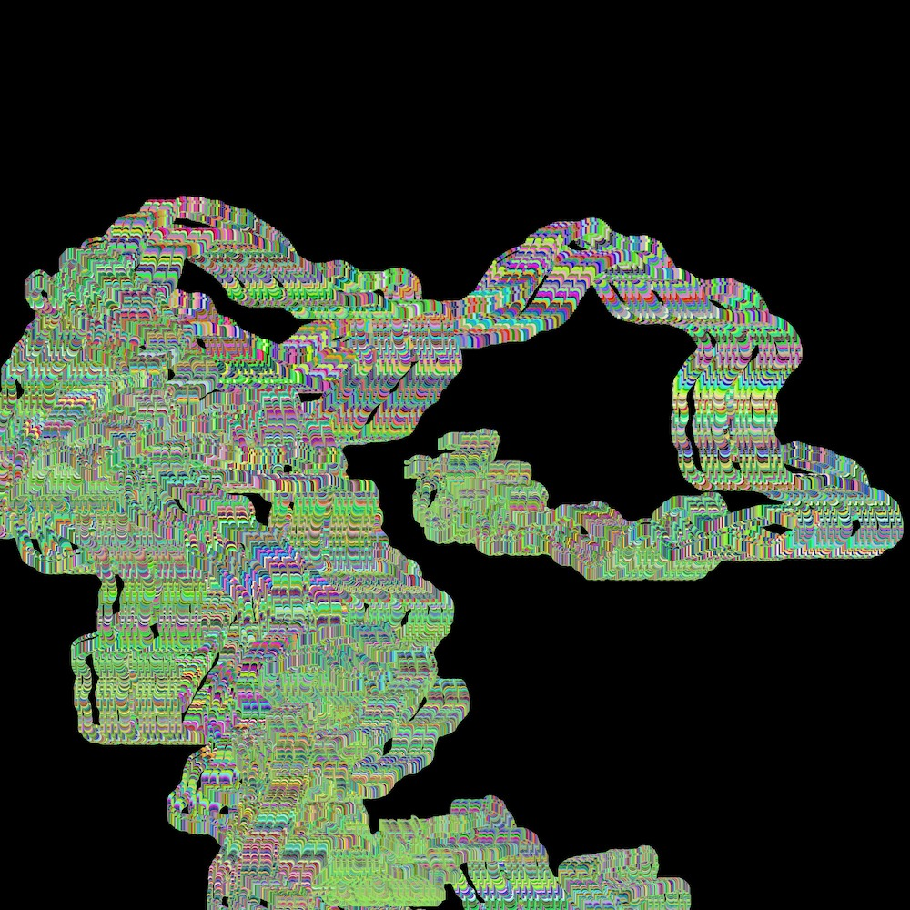
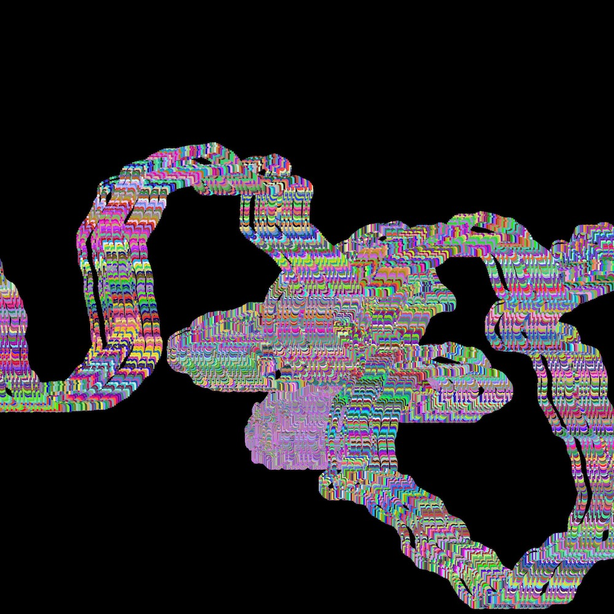

# Random Rainbow

Made with [p5.js](https://p5js.org/) and 🐟.

To see it in action, download the project and open `index.html` in your
favourite browser (n.b. maybe this won't work on some lame browsers).

## Commands

Just hit those keys:

-   `S` save the canvas
-   `R` restart the whole thing
-   `D` repaint in black (without restarting the position)

## Customization

If you feel adventurous, you can modify a bunch of variables in the `sketch.js` file (in the setup function).

## 🌈

